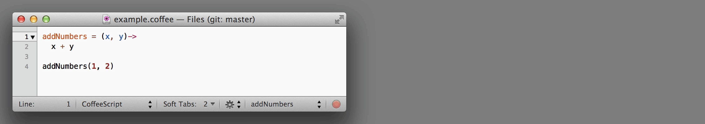
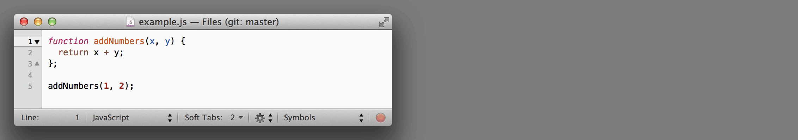
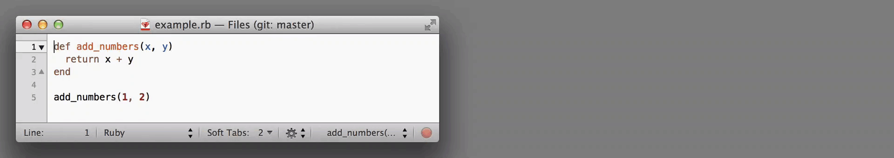
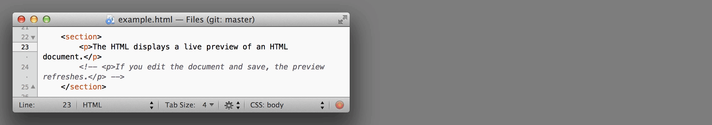
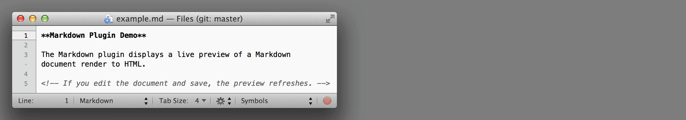
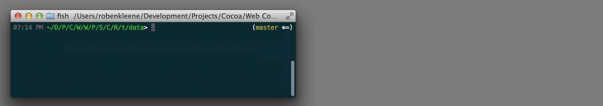

# Web Console

Web Console is an OS X application for creating and running custom plugins that wrap command line programs in web user interfaces.

The Web Console application performs two main functions:

1. **Runs command line tasks**: command line programs are run as subprocesses.
2. **Provide web view with an API to running tasks**: subprocesses can manipulate the parent processes web view and displaying output and provide a user interface.

There are three components that combine to make the application useful:

1. **The Web Console application**
2. **[A TextMate Bundle](https://github.com/robenkleene/Web-Console-tmbundle)**
3. **A Ruby gem**

But, there is nothing inherent to Web Console the requires Ruby or TextMate. Any language can be used to write plugins, and it can integrate with any editor.

# Status

Web Console is in pre-alpha, while the existing plugins are useful, the application is not ready for regular use and there is not a binary distribution yet.

## Timeline

1. A plugin manager will be built.
2. Preferences will be added for configuring Web Console to a open specific plugin by file type.
3. The web view API will be expanded to handle loading a URL.

Progress on the plugin manager (#1) and the preferences for opening files with plugins (#2) is in the [Web Console Prototypes repository](https://github.com/robenkleene/Web-Console-Prototypes).

# TextMate Bundle

The [TextMate Bundle](https://github.com/robenkleene/Web-Console-tmbundle) illustrates how Web Console's features can be integrated into a text editor.

# Built-in Plugins

While these plugins are already useful, they are only at the proof of concept stage. Final implementations would only superficially resemble these.

## Editor Agnostic REPLs

Web Console includes several REPLs, that can evaluate code from any editor (by sending it to a plugins subprocess [standard input](http://en.wikipedia.org/wiki/Standard_input). State is maintained by hosting a running instance of the REPL executable.

### CoffeeScript

### Node

### IRB

## Live Web Previews

Live web previews watch files on disk and automatically refresh themselves when files change.

### HTML

### Markdown

## Command Line GUIs

User interfaces wrapped around command line programs to interact with them seamlessly.

### Search

# Building From Source

## Requirements

1. [OS X Mavericks](http://www.apple.com/osx/)
2. [Xcode](https://developer.apple.com/xcode/)
3. Xcode Command Line Tools

## Build & Run

1. Checkout the source code:

		git clone git@github.com:robenkleene/Web-Console.git

2. Open `Web Console/Web Console.xcodeproj`
3. Run in Xcode

## Running Tests

1. Install the Ruby gem:

		gem install webconsole

	The gem is required for running tests (plugins themselves bundle the Ruby gem, the gem only needs to be installed globally for running tests).

	All built-in Web Console plugins and tests use Ruby version 2.0.0-p247, the same version shipped with OS X Mavericks. (It's recommended that you setup a Ruby version manager before installing the Web Console Ruby gem.)

2. Open `Web Console/Scripts/test` in a shell and run:

		run_tests.sh

# License

GPLv3